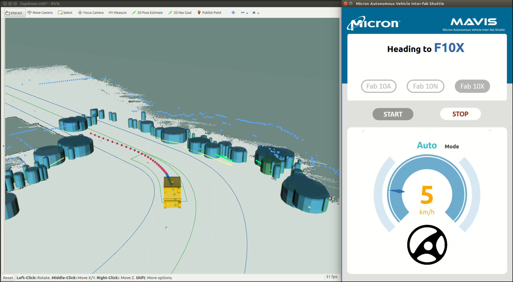

# frenet_optimal_planner
Implementation of Frenet Optimal Planning Algorithm in ROS





## Dependencies
* C++11 above
* CMake: 3.0.2 above
* ROS Packages:
    * roscpp
    * rospy
    * std_msgs
    * nav_msgs
    * geometry_msgs
    * autoware_msgs
    * message_generation
    * dynamic_reconfigure
    * tf
    * tf2_ros


## Usage

Clone the repo and install dependencies:
```bash
# clone the repo
git clone https://github.com/SS47816/frenet_optimal_planner.git
cd frenet_optimal_planner

# install dependencies
rosdep install --from-paths src --ignore-src -r -y

# build
catkin_make
# or you can build with
catkin build
```

## License